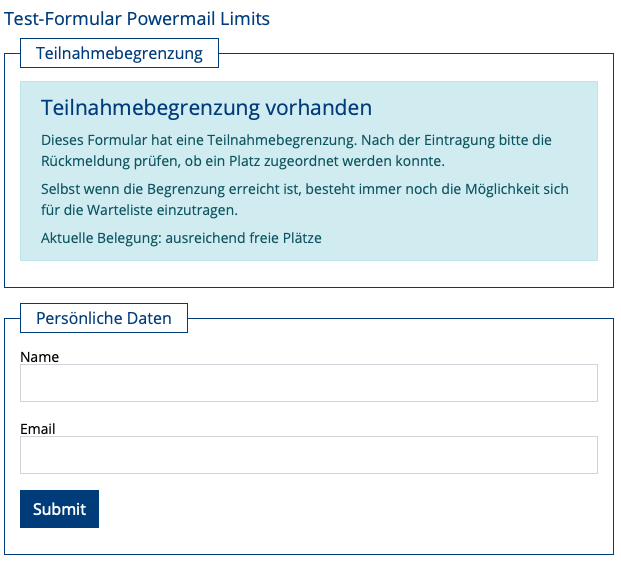
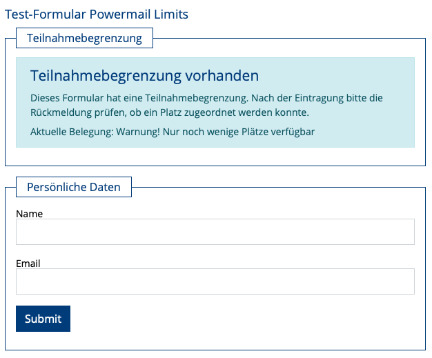
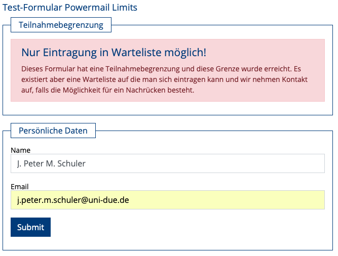
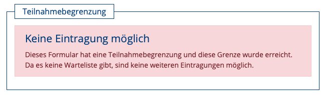
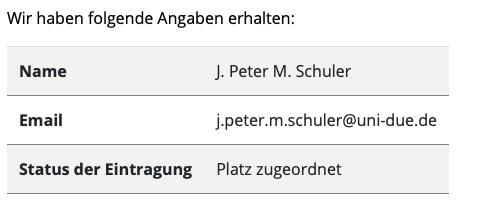
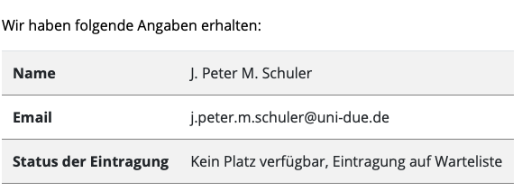
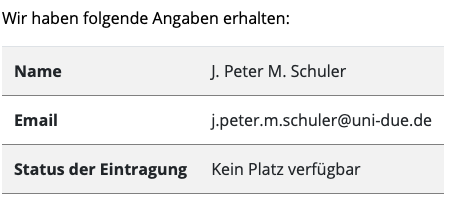
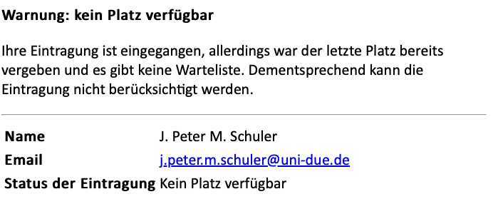
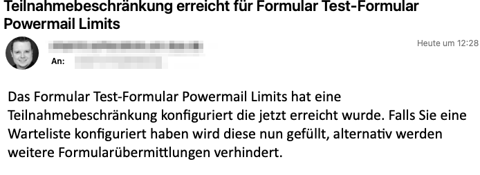

[](https://github.com/jpmschuler/TYPO3-powermail-limits/actions/workflows/ci.yml)


# EXT:powermail_limits
This extension allows you to set a submission limit for a TYPO3 EXT:powermail form

# Compatibility
- TYPO3: ^11
- PHP: ^7.4
- EXT:powermail ^10

# Installation
`composer req jpmschuler/powermail-limits`, no legacy install available

# What it does
A form gets 3 new fields
- `submissionlimit`: 0 for disable or number of maximum submission
- `haswaitlist`: should the form be available after submissions are full to create a waitlist
- `showpercentage`: should there be an indicator for how many slots are left

In case of a configured limit:
- A new first "page" is prepended to the form with an infobox showing there is a limit, if that limit is reached, if a waiting list exists.
- If no waiting list and limit reached: rendering of other pages and submit is prohibited
- A field is added to the answers, indicating if it is a valid submission or a waiting list submission
- In case on invalid submission (limit reached, no waiting list) the mails are overridden to inform the user (Prefix for subject and body) and the mail record is marked hidden

Backend administration:
- invalid submissions are marked hidden
- remove valid submission by marking them hidden
- for the limit all valid submissions, including wait list entries are counted.
- so if you have 10 people on the waiting list, disable 5 previously valid submissions the form will add all new submission to waiting list nevertheless
- contacting the applicants to move them from waiting list to valid slot is not done via the extension, but a manual process

# Labels and Overrides
All labels are currently locally managed and available in `en` and `de`. Thus, they can easily be overridden.
The indictator is calculated in 10percent rounded-down steps, so e.g. if there are 87% of slots filled, the label for 80 is shown. This allows a bit of transparency without telling everybody that nobody registered for that 2000 participants event or without telling everybody you really had only 8 slots.
```
form.submissionspercentage.0: enough free slots
form.submissionspercentage.10: enough free slots
form.submissionspercentage.20: enough free slots
form.submissionspercentage.30: enough free slots
form.submissionspercentage.40: enough free slots
form.submissionspercentage.50: enough free slots
form.submissionspercentage.60: still slots available
form.submissionspercentage.70: still slots available
form.submissionspercentage.80: still slots available
form.submissionspercentage.90: Warning! Only a few slots available
```

# ToDo
- [ ] override backend module mail entry subject
- [ ] override answer page with visual warning prefix
- [ ] add backend powermail module deep link to limit reached mail

# Preview

##  Infobox as first element in form




## Dynamically added field about status



## Dynamically added mail prefixes


## Additional mail if limit reached

